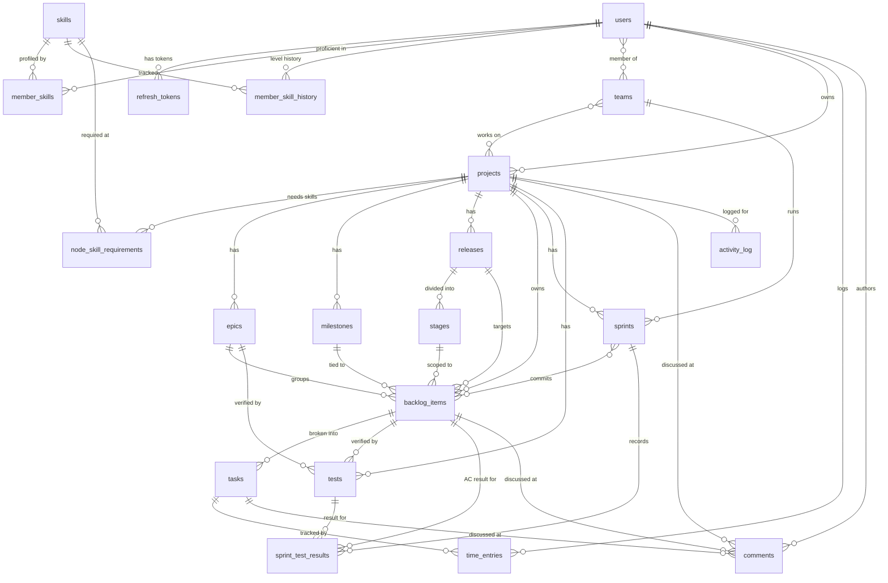

# V.42 Database Data Model

> Ground truth: PostgreSQL 16. Schema is authoritative. This document is generated from
> migrations (000001-000019) and sqlc-generated models (`internal/db/gen/models.go`).

---

## Table of Contents

1. [Overview](#overview)
2. [ENUM Types](#enum-types)
3. [Entity Catalog](#entity-catalog)
   - [users](#users)
   - [refresh_tokens](#refresh_tokens)
   - [skills](#skills)
   - [member_skills](#member_skills)
   - [member_skill_history](#member_skill_history)
   - [teams](#teams)
   - [team_members](#team_members)
   - [projects](#projects)
   - [project_teams](#project_teams)
   - [node_skill_requirements](#node_skill_requirements)
   - [epics](#epics)
   - [milestones](#milestones)
   - [releases](#releases)
   - [stages](#stages)
   - [backlog_items](#backlog_items)
   - [tasks](#tasks)
   - [sprints](#sprints)
   - [sprint_items](#sprint_items)
   - [tests](#tests)
   - [test_dependencies](#test_dependencies)
   - [sprint_test_results](#sprint_test_results)
   - [time_entries](#time_entries)
   - [comments](#comments)
   - [activity_log](#activity_log)
   - [outbox](#outbox)
4. [Relationship Summary](#relationship-summary)
5. [Key Business Rules and Invariants](#key-business-rules-and-invariants)
6. [ER Diagram](#er-diagram)

---

## Overview

25 tables, 14 ENUM types. Schema is designed around three conceptual layers:

| Layer | Tables | Purpose |
|-------|--------|---------|
| Identity & Access | `users`, `refresh_tokens` | Authentication, authorization, session lifecycle |
| Competency | `skills`, `member_skills`, `member_skill_history` | Skill catalog, user proficiency, growth tracking |
| Organization | `teams`, `team_members`, `projects`, `project_teams`, `node_skill_requirements`, `milestones` | Who works where, on what, with what skills |
| Planning | `epics`, `releases`, `stages`, `backlog_items` | WHAT to build and WHEN |
| Execution | `tasks`, `sprints`, `sprint_items`, `time_entries` | HOW we build it |
| Quality | `tests`, `test_dependencies`, `sprint_test_results` | Acceptance criteria and test execution |
| Collaboration | `comments`, `activity_log`, `outbox` | Discussion, audit trail, event delivery |

Creation order (FK dependency chain):

```
users -> skills -> teams -> team_members -> member_skills -> refresh_tokens
      -> projects -> epics -> releases -> stages
      -> backlog_items -> tasks -> sprints -> sprint_items
      -> tests -> test_dependencies -> time_entries -> sprint_test_results -> comments
      -> activity_log -> outbox
```

All primary keys are `UUID DEFAULT gen_random_uuid()`. All timestamps are `TIMESTAMPTZ`.
FLOAT8 priority/order_index columns use the midpoint trick for O(1) drag-and-drop reordering.

---

## ENUM Types

### user_role
System-wide access level. Controls write access and visibility.

| Value | Description |
|-------|-------------|
| `admin` | Full access: manages users, teams, projects, instance settings |
| `maintainer` | Manages projects and teams; cannot manage other admins |
| `developer` | Creates and works on tasks and backlog items |
| `tester` | Creates and executes tests |
| `observer` | Read-only; cannot write comments or items |

### skill_level
Dreyfus-inspired proficiency scale.

| Value | Description |
|-------|-------------|
| `novice` | No prior experience; needs constant guidance |
| `beginner` | Learning; needs guidance on most tasks |
| `competent` | Can work independently; knows best practices |
| `proficient` | Does it well; can review and guide others |
| `expert` | Deep mastery; can mentor and drive architectural decisions |

> Note: `novice` was added in migration 000005 (growth_mechanics). The original
> schema from migration 000002 started with `beginner`.

### interest_level
User's desire to use or grow in a skill.

| Value | Description |
|-------|-------------|
| `low` | Prefer not to work with this skill |
| `medium` | Neutral; would work with it |
| `high` | Actively wants to grow or use this skill |

### team_category
Organizational classification of teams.

| Value | Description |
|-------|-------------|
| `normal` | A standard delivery team |
| `admin_team` | Platform/DevOps/infrastructure team |
| `management_team` | Leadership or cross-functional oversight team |

### project_status
Lifecycle state of a project node.

| Value | Description |
|-------|-------------|
| `active` | Actively worked on |
| `on_hold` | Paused; not deleted |
| `archived` | Soft-deleted via `is_archived = true` |

### epic_status
Lifecycle of an epic.

| Value | Description |
|-------|-------------|
| `draft` | Not yet committed |
| `active` | In progress |
| `done` | All linked items delivered |
| `cancelled` | Abandoned |

### item_type
Category of a backlog item.

| Value | Description |
|-------|-------------|
| `story` | User-facing feature or capability |
| `bug` | Defect to fix |
| `feature` | Larger functional addition |
| `technical_debt` | Internal improvement (non-functional) |

### item_status
Kanban flow state of a backlog item. Extended in migration 000014.

| Value | Description |
|-------|-------------|
| `backlog` | Not yet groomed or committed |
| `ready` | Groomed; acceptance criteria written; ready for sprint |
| `in_progress` | Being worked on in a sprint |
| `review` | Done but pending review or QA |
| `done` | Acceptance test passed; item closed |
| `cancelled` | Will not be done |
| `planned` | Committed to a release/milestone but not yet sprinted |
| `open` | Unassigned/newly created (alias for early triage) |
| `in_review` | Under code/product review |
| `request` | External request, not yet accepted |
| `on_hold` | Blocked or waiting on external dependency |
| `rejected` | Explicitly not accepted |

### task_status
State of a task within a backlog item.

| Value | Description |
|-------|-------------|
| `todo` | Not started |
| `in_progress` | Being worked on |
| `done` | Implementation complete |
| `cancelled` | Will not be done |

### test_type
Classification of a test.

| Value | Description |
|-------|-------------|
| `manual` | Manually executed by a tester |
| `acceptance` | Acceptance criteria verification |
| `integration` | Cross-component or cross-service test |
| `unit` | Isolated function-level test |

### test_run_status
Execution result of a test in a sprint run.

| Value | Description |
|-------|-------------|
| `pass` | Test passed; acceptance criteria met |
| `failed` | Test failed; item cannot be marked done |
| `skipped` | Auto-skipped: a dependency test failed |
| `disabled` | Manually excluded from this sprint run |
| `on_hold` | Feature not yet implemented; test cannot run |

### sprint_status
Lifecycle of a sprint.

| Value | Description |
|-------|-------------|
| `planning` | Sprint being assembled; items can be added or removed |
| `active` | Sprint is running; triggers test-results initialization |
| `completed` | Sprint ended; results recorded |
| `cancelled` | Sprint abandoned |

### release_status
Lifecycle of a release.

| Value | Description |
|-------|-------------|
| `planning` | Being planned; no code shipped |
| `active` | Items being delivered against this release |
| `released` | Shipped to production |
| `cancelled` | Abandoned |

### stage_status
Lifecycle of a stage within a release.

| Value | Description |
|-------|-------------|
| `pending` | Not yet started |
| `active` | In execution |
| `completed` | Delivered |
| `cancelled` | Dropped |

---

## Entity Catalog

---

### users

Core identity and authentication record. One row per human (or service account).

| Column | Type | Nullable | Default | Notes |
|--------|------|----------|---------|-------|
| `id` | UUID | NO | gen_random_uuid() | PK |
| `email` | TEXT | NO | - | UNIQUE; used for login |
| `password_hash` | TEXT | NO | - | bcrypt; never returned in API responses |
| `display_name` | TEXT | NO | - | Public name; max 200 chars |
| `role` | user_role | NO | `developer` | System-wide access level |
| `is_active` | BOOLEAN | NO | `true` | Deactivated users cannot log in; their data stays |
| `avatar_url` | TEXT | YES | NULL | External image URL; max 2048 chars |
| `theme` | TEXT | NO | `light` | UI theme preference (light/dark/new-york); server-stored |
| `must_change_password` | BOOLEAN | NO | `false` | Forces password change on next login |
| `idle_timeout_minutes` | INTEGER | NO | `30` | Auto-logout after inactivity; 0 = never |
| `created_at` | TIMESTAMPTZ | NO | now() | - |
| `updated_at` | TIMESTAMPTZ | NO | now() | - |

**Indexes:** `idx_users_email` on `email`.

**Business rules:**
- An admin cannot deactivate their own account (enforced in handler, not DB).
- `must_change_password` is set to `true` on user creation; cleared by `POST /auth/change-password`.
- `password_hash` is bcrypt cost 12.

---

### refresh_tokens

JWT refresh token store. Enables token rotation and single-device logout revocation.
Implements replay-attack detection: if a revoked token is presented, all tokens for
that user are revoked immediately.

| Column | Type | Nullable | Default | Notes |
|--------|------|----------|---------|-------|
| `id` | UUID | NO | gen_random_uuid() | PK |
| `user_id` | UUID | NO | - | FK -> users; CASCADE DELETE |
| `token_hash` | TEXT | NO | - | UNIQUE; SHA-256 hex of the raw token; never plaintext |
| `expires_at` | TIMESTAMPTZ | NO | - | Token TTL (7 days from issuance) |
| `created_at` | TIMESTAMPTZ | NO | now() | - |
| `revoked_at` | TIMESTAMPTZ | YES | NULL | NULL = active; set on logout or rotation |

**Indexes:** `idx_refresh_tokens_user` on `user_id`; `idx_refresh_tokens_hash` on `token_hash`.

---

### skills

Global skill catalog. Built-in skills are seeded in migration 000004 and cannot be deleted.
Custom skills can be created by admins. Hidden skills are excluded from default listings.

| Column | Type | Nullable | Default | Notes |
|--------|------|----------|---------|-------|
| `id` | UUID | NO | gen_random_uuid() | PK |
| `name` | TEXT | NO | - | UNIQUE; e.g. "Go", "React", "PostgreSQL"; max 100 chars |
| `category` | TEXT | YES | NULL | Grouping label; e.g. "Backend", "Frontend", "QA" |
| `is_builtin` | BOOLEAN | NO | `false` | Built-in skills cannot be deleted; use `is_hidden` instead |
| `is_hidden` | BOOLEAN | NO | `false` | Hidden from default skill listings; set on obsolete skills |
| `created_at` | TIMESTAMPTZ | NO | now() | - |

**Business rules:**
- DELETE fails with 409 Conflict for built-in skills.
- `GET /skills` omits hidden skills by default; `?all=true` (admin only) includes them.

---

### member_skills

User-to-skill proficiency profile. Upsert semantics: PUT replaces the existing entry.

| Column | Type | Nullable | Default | Notes |
|--------|------|----------|---------|-------|
| `user_id` | UUID | NO | - | PK part; FK -> users; CASCADE DELETE |
| `skill_id` | UUID | NO | - | PK part; FK -> skills; CASCADE DELETE |
| `level` | skill_level | NO | `beginner` | Proficiency level |
| `interest` | interest_level | NO | `medium` | Desire to work in this skill |
| `interest_note` | TEXT | YES | NULL | Free-form note; e.g. "want to learn GAS" |
| `created_at` | TIMESTAMPTZ | NO | now() | - |
| `updated_at` | TIMESTAMPTZ | NO | now() | - |

**PK:** `(user_id, skill_id)`.

---

### member_skill_history

Audit trail for skill level changes. Written automatically on every `member_skills` upsert.

| Column | Type | Nullable | Default | Notes |
|--------|------|----------|---------|-------|
| `id` | UUID | NO | gen_random_uuid() | PK |
| `user_id` | UUID | NO | - | FK -> users |
| `skill_id` | UUID | NO | - | FK -> skills |
| `level_from` | skill_level | YES | NULL | NULL on first insert |
| `level_to` | skill_level | NO | - | New level |
| `changed_by` | UUID | NO | - | FK -> users; who made the change |
| `changed_at` | TIMESTAMPTZ | NO | now() | - |

**Append-only:** no update or delete.

---

### teams

A group of users working together. Teams are the primary organizational unit.

| Column | Type | Nullable | Default | Notes |
|--------|------|----------|---------|-------|
| `id` | UUID | NO | gen_random_uuid() | PK |
| `name` | TEXT | NO | - | max 200 chars |
| `description` | TEXT | YES | NULL | - |
| `is_archived` | BOOLEAN | NO | `false` | Soft-delete; archived teams are hidden from default listings |
| `category` | team_category | NO | `normal` | Organizational type (added migration 000019) |
| `created_at` | TIMESTAMPTZ | NO | now() | - |
| `updated_at` | TIMESTAMPTZ | NO | now() | - |

---

### team_members

Team membership with per-member weekly capacity.

| Column | Type | Nullable | Default | Notes |
|--------|------|----------|---------|-------|
| `team_id` | UUID | NO | - | PK part; FK -> teams; CASCADE DELETE |
| `user_id` | UUID | NO | - | PK part; FK -> users; CASCADE DELETE |
| `capacity_hours` | SMALLINT | NO | `32` | Weekly hours available for project work |
| `joined_at` | TIMESTAMPTZ | NO | now() | - |

**PK:** `(team_id, user_id)`.

---

### projects

Hierarchical project node. Supports tree structures: programs contain projects, projects
contain phases, phases contain milestones — all in the same table via self-referential
`parent_id`. A NULL `parent_id` means a root node.

| Column | Type | Nullable | Default | Notes |
|--------|------|----------|---------|-------|
| `id` | UUID | NO | gen_random_uuid() | PK |
| `name` | TEXT | NO | - | - |
| `description` | TEXT | YES | NULL | - |
| `status` | project_status | NO | `active` | - |
| `owner_id` | UUID | NO | - | FK -> users; project manager / DRI |
| `parent_id` | UUID | YES | NULL | FK -> projects (self); NULL = root node |
| `order_index` | FLOAT8 | NO | `0` | Sibling ordering; midpoint trick for O(1) reorder |
| `node_number` | BIGINT | NO | - | Sequential number within parent; display use |
| `is_archived` | BOOLEAN | NO | `false` | Soft-delete |
| `start_date` | DATE | YES | NULL | Optional timeline anchor |
| `end_date` | DATE | YES | NULL | Optional timeline anchor |
| `open_items` | INTEGER | NO | `0` | Cached count of non-done backlog items |
| `total_items` | INTEGER | NO | `0` | Cached count of all backlog items |
| `clarity_score` | NUMERIC | YES | NULL | Computed clarity distribution score (0-100) |
| `stats_dirty` | BOOLEAN | NO | `true` | Signals that cached stats need refresh |
| `stats_updated_at` | TIMESTAMPTZ | YES | NULL | Timestamp of last stats recalculation |
| `created_at` | TIMESTAMPTZ | NO | now() | - |
| `updated_at` | TIMESTAMPTZ | NO | now() | - |

**Business rules:**
- Deleting a project cascades to all children (epics, backlog items, tasks, tests, sprints).
- Archive (`is_archived = true`) is the preferred soft-delete; use DELETE only when you mean it.
- Visibility rule: a user sees a project only if they belong to at least one team linked
  via `project_teams`. Admins see all projects.

---

### project_teams

Many-to-many junction between projects and teams. A project can have multiple teams
(dev, QA, ops); a team can work on multiple projects simultaneously.

| Column | Type | Nullable | Default | Notes |
|--------|------|----------|---------|-------|
| `project_id` | UUID | NO | - | PK part; FK -> projects; CASCADE DELETE |
| `team_id` | UUID | NO | - | PK part; FK -> teams; CASCADE DELETE |
| `added_at` | TIMESTAMPTZ | NO | now() | - |

**PK:** `(project_id, team_id)`.
**Indexes:** `idx_project_teams_project`, `idx_project_teams_team`.

**Visibility query:** user can access project if:
```sql
EXISTS (
    SELECT 1 FROM project_teams pt
    JOIN team_members tm ON tm.team_id = pt.team_id
    WHERE pt.project_id = $project_id AND tm.user_id = $user_id
)
```

---

### node_skill_requirements

Skill requirements declared on a project node. Used for capacity planning:
"this project phase requires 2 Go experts and 1 QA proficient in Selenium."

| Column | Type | Nullable | Default | Notes |
|--------|------|----------|---------|-------|
| `node_id` | UUID | NO | - | PK part; FK -> projects |
| `skill_id` | UUID | NO | - | PK part; FK -> skills |
| `min_level` | skill_level | NO | - | Minimum acceptable proficiency level |
| `headcount` | SMALLINT | NO | `1` | Number of people needed at this level |
| `notes` | TEXT | YES | NULL | Free-form context |

**PK:** `(node_id, skill_id)`.

---

### epics

Thematic grouping of backlog items. Epics answer WHAT we are building.
They are independent of releases (WHEN) — one epic can span multiple releases.

| Column | Type | Nullable | Default | Notes |
|--------|------|----------|---------|-------|
| `id` | UUID | NO | gen_random_uuid() | PK |
| `project_id` | UUID | NO | - | FK -> projects; CASCADE DELETE |
| `title` | TEXT | NO | - | - |
| `description` | TEXT | YES | NULL | - |
| `status` | epic_status | NO | `draft` | Lifecycle state |
| `clarity` | TEXT | NO | `unknown` | Cynefin-based clarity level (see below) |
| `owner_id` | UUID | YES | NULL | FK -> users; SET NULL on user delete |
| `target_date` | DATE | YES | NULL | Optional milestone anchor |
| `number` | BIGINT | NO | - | Sequential display number within project |
| `seq_number` | BIGINT | NO | - | Global sequence number |
| `order_index` | FLOAT8 | NO | `0` | Ordering within project epic list |
| `created_at` | TIMESTAMPTZ | NO | now() | - |
| `updated_at` | TIMESTAMPTZ | NO | now() | - |

**Indexes:** `idx_epics_project` on `project_id`.

**Clarity values (stored as TEXT, not ENUM):**
`unknown`, `foggy`, `tacit`, `scoped`, `clear` — based on the Cynefin framework.

---

### milestones

Named target dates within a project. Lightweight anchors for planning and reporting.
Not related to releases or stages — a separate simple concept.

| Column | Type | Nullable | Default | Notes |
|--------|------|----------|---------|-------|
| `id` | UUID | NO | gen_random_uuid() | PK |
| `project_id` | UUID | NO | - | FK -> projects; CASCADE DELETE |
| `name` | TEXT | NO | - | e.g. "Beta Launch", "Customer Demo" |
| `description` | TEXT | YES | NULL | - |
| `target_date` | DATE | YES | NULL | - |
| `seq_number` | BIGINT | NO | - | Sequential number within project |
| `created_at` | TIMESTAMPTZ | NO | now() | - |
| `updated_at` | TIMESTAMPTZ | NO | now() | - |

---

### releases

Temporal planning dimension: WHEN we ship. Independent of epics (what).
A release can contain items from multiple epics; one epic can span multiple releases.

| Column | Type | Nullable | Default | Notes |
|--------|------|----------|---------|-------|
| `id` | UUID | NO | gen_random_uuid() | PK |
| `project_id` | UUID | NO | - | FK -> projects; CASCADE DELETE |
| `name` | TEXT | NO | - | e.g. "v2.0", "2026-Q3" |
| `description` | TEXT | YES | NULL | - |
| `status` | release_status | NO | `planning` | Lifecycle state |
| `start_date` | DATE | YES | NULL | - |
| `end_date` | DATE | YES | NULL | - |
| `created_at` | TIMESTAMPTZ | NO | now() | - |
| `updated_at` | TIMESTAMPTZ | NO | now() | - |

**Indexes:** `idx_releases_project` on `project_id`.

> API: Releases CRUD is **Phase 5 — not yet implemented**. Schema exists.

---

### stages

Ordered phases within a release. A release is divided into stages
(e.g., Alpha, Beta, RC, GA). Backlog items reference stages directly.

| Column | Type | Nullable | Default | Notes |
|--------|------|----------|---------|-------|
| `id` | UUID | NO | gen_random_uuid() | PK |
| `release_id` | UUID | NO | - | FK -> releases; CASCADE DELETE |
| `name` | TEXT | NO | - | e.g. "Alpha", "Beta", "RC" |
| `description` | TEXT | YES | NULL | - |
| `status` | stage_status | NO | `pending` | Lifecycle state |
| `start_date` | DATE | YES | NULL | - |
| `end_date` | DATE | YES | NULL | - |
| `order_index` | FLOAT8 | NO | `0` | Ordering within release; midpoint trick |
| `created_at` | TIMESTAMPTZ | NO | now() | - |
| `updated_at` | TIMESTAMPTZ | NO | now() | - |

**Indexes:** `idx_stages_release` on `release_id`.

---

### backlog_items

The heart of the system. Each row is simultaneously a work item AND its acceptance
criteria (ATDD model). An item without `ac_steps` is a wish, not a commitment.

| Column | Type | Nullable | Default | Notes |
|--------|------|----------|---------|-------|
| `id` | UUID | NO | gen_random_uuid() | PK |
| `project_id` | UUID | NO | - | FK -> projects; CASCADE DELETE |
| `epic_id` | UUID | YES | NULL | FK -> epics; SET NULL (optional) |
| `release_id` | UUID | YES | NULL | FK -> releases; SET NULL (optional) |
| `stage_id` | UUID | YES | NULL | FK -> stages; SET NULL (optional) |
| `node_id` | UUID | YES | NULL | FK -> projects; project hierarchy node |
| `milestone_id` | UUID | YES | NULL | FK -> milestones; SET NULL (optional) |
| `title` | TEXT | NO | - | - |
| `description` | TEXT | YES | NULL | WHY this item exists (for humans) |
| `type` | item_type | NO | `story` | Categorization |
| `status` | item_status | NO | `backlog` | Kanban flow state |
| `clarity` | TEXT | NO | `unknown` | Cynefin-based clarity level |
| `priority` | FLOAT8 | NO | `0` | Drag-and-drop order; midpoint trick |
| `estimate` | TEXT | YES | NULL | Free-form: "3h", "5 pts", "L", "half a day" |
| `assignee_id` | UUID | YES | NULL | FK -> users; SET NULL |
| `skill_required` | UUID | YES | NULL | FK -> skills; primary skill needed |
| `ac_setup` | TEXT | YES | NULL | Preconditions: env, data, user state |
| `ac_steps` | TEXT | YES | NULL | Step-by-step verification instructions |
| `ac_expected` | TEXT | YES | NULL | Expected outcome when the test passes |
| `created_by` | UUID | NO | - | FK -> users; creator (immutable) |
| `number` | BIGINT | NO | - | Sequential display number within project |
| `seq_number` | BIGINT | NO | - | Global sequence number |
| `created_at` | TIMESTAMPTZ | NO | now() | - |
| `updated_at` | TIMESTAMPTZ | NO | now() | - |

**Indexes:**
- `idx_backlog_project` on `project_id`
- `idx_backlog_epic` on `epic_id` WHERE NOT NULL
- `idx_backlog_release` on `release_id` WHERE NOT NULL
- `idx_backlog_stage` on `stage_id` WHERE NOT NULL
- `idx_backlog_status` on `(project_id, status)`
- `idx_backlog_priority` on `(project_id, priority)`

**Reorder:** `POST /projects/{id}/backlog/reorder` accepts `{items:[{id, priority}]}` and
updates priorities atomically in a single transaction.

**ATDD contract:** `status = done` is only valid if the corresponding `sprint_test_results`
row has `status = pass`. Enforced in the domain layer (`domain/backlog.go`), not the DB.

---

### tasks

Implementation subtasks of a backlog item. Tasks are the path to a green
acceptance test. Actual hours = `SUM(time_entries.hours)` — no dual source of truth.

| Column | Type | Nullable | Default | Notes |
|--------|------|----------|---------|-------|
| `id` | UUID | NO | gen_random_uuid() | PK |
| `backlog_item_id` | UUID | NO | - | FK -> backlog_items; CASCADE DELETE |
| `title` | TEXT | NO | - | - |
| `description` | TEXT | YES | NULL | - |
| `status` | task_status | NO | `todo` | Lifecycle state |
| `estimate` | TEXT | YES | NULL | Same free-form convention as backlog_items |
| `order_index` | FLOAT8 | NO | `0` | Display order within the item; midpoint trick |
| `assignee_id` | UUID | YES | NULL | FK -> users; SET NULL |
| `skill_required` | UUID | YES | NULL | FK -> skills; SET NULL |
| `reviewer_id` | UUID | YES | NULL | FK -> users; SET NULL; optional code reviewer |
| `created_by` | UUID | NO | - | FK -> users; creator (immutable) |
| `seq_number` | BIGINT | NO | - | Global sequence number |
| `created_at` | TIMESTAMPTZ | NO | now() | - |
| `updated_at` | TIMESTAMPTZ | NO | now() | - |

**Indexes:** `idx_tasks_backlog_item` on `backlog_item_id`; `idx_tasks_assignee` WHERE NOT NULL.

**Move:** A task can be moved to a different backlog item via
`POST /projects/{id}/backlog/{item_id}/tasks/{task_id}/move`.

---

### sprints

Time-boxed iteration (Scrum sprint). Belongs to a project; one team runs one sprint
at a time, but a project can have multiple concurrent sprints from different teams.

| Column | Type | Nullable | Default | Notes |
|--------|------|----------|---------|-------|
| `id` | UUID | NO | gen_random_uuid() | PK |
| `project_id` | UUID | NO | - | FK -> projects; CASCADE DELETE |
| `team_id` | UUID | YES | NULL | FK -> teams; SET NULL (which team runs this sprint) |
| `name` | TEXT | NO | - | e.g. "Sprint 3", "2026-Q2-S1" |
| `goal` | TEXT | YES | NULL | Sprint goal description (free-form) |
| `status` | sprint_status | NO | `planning` | Lifecycle state |
| `start_date` | DATE | YES | NULL | - |
| `end_date` | DATE | YES | NULL | - |
| `capacity_hours` | SMALLINT | YES | NULL | Total planned team hours |
| `sprint_number` | BIGINT | NO | - | Sequential sprint number within project |
| `order_index` | FLOAT8 | NO | `0` | Display ordering |
| `created_at` | TIMESTAMPTZ | NO | now() | - |
| `updated_at` | TIMESTAMPTZ | NO | now() | - |

**Indexes:** `idx_sprints_project` on `project_id`.

**Side effect:** Setting `status = active` automatically calls the
`test-results/init` logic which seeds `sprint_test_results` rows for all tests
and backlog items in the sprint with `status = skipped`.

---

### sprint_items

Junction table: which backlog items are committed to a sprint.

| Column | Type | Nullable | Default | Notes |
|--------|------|----------|---------|-------|
| `sprint_id` | UUID | NO | - | PK part; FK -> sprints; CASCADE DELETE |
| `backlog_item_id` | UUID | NO | - | PK part; FK -> backlog_items; CASCADE DELETE |
| `added_at` | TIMESTAMPTZ | NO | now() | - |

**PK:** `(sprint_id, backlog_item_id)`.

---

### tests

Acceptance or regression tests. Defined once, executed once per sprint.
Tests live at one of three scopes, determined by which nullable FK is set:
- **Backlog item scope:** `backlog_item_id IS NOT NULL` (item acceptance test)
- **Epic scope:** `epic_id IS NOT NULL` (epic-level acceptance test)
- **Project scope:** both NULL (project-level regression or integration test)

| Column | Type | Nullable | Default | Notes |
|--------|------|----------|---------|-------|
| `id` | UUID | NO | gen_random_uuid() | PK |
| `project_id` | UUID | NO | - | FK -> projects; CASCADE DELETE (always set) |
| `backlog_item_id` | UUID | YES | NULL | FK -> backlog_items; CASCADE DELETE |
| `epic_id` | UUID | YES | NULL | FK -> epics; CASCADE DELETE |
| `title` | TEXT | NO | - | - |
| `description` | TEXT | YES | NULL | - |
| `setup` | TEXT | YES | NULL | Preconditions: env, data, user state |
| `config` | TEXT | YES | NULL | Configuration parameters during test |
| `steps` | TEXT | YES | NULL | Numbered step-by-step execution instructions |
| `expected_results` | TEXT | YES | NULL | What should happen when the test passes |
| `type` | test_type | NO | `manual` | Classification |
| `created_by` | UUID | NO | - | FK -> users; creator (immutable) |
| `seq_number` | BIGINT | NO | - | Global sequence number |
| `created_at` | TIMESTAMPTZ | NO | now() | - |
| `updated_at` | TIMESTAMPTZ | NO | now() | - |

**Indexes:**
- `idx_tests_project` on `project_id`
- `idx_tests_backlog_item` on `backlog_item_id` WHERE NOT NULL
- `idx_tests_epic` on `epic_id` WHERE NOT NULL

---

### test_dependencies

Directed dependency graph between tests. If `depends_on` fails, `test` is
auto-skipped with a `skip_reason` message.

| Column | Type | Nullable | Default | Notes |
|--------|------|----------|---------|-------|
| `test_id` | UUID | NO | - | PK part; FK -> tests; CASCADE DELETE |
| `depends_on_id` | UUID | NO | - | PK part; FK -> tests; CASCADE DELETE |

**PK:** `(test_id, depends_on_id)`.
**Constraint:** `CHECK (test_id != depends_on_id)` — no self-dependency.

---

### sprint_test_results

One result row per subject per sprint. The subject is either a regression test or
a backlog item's acceptance criteria. Exactly one of `test_id` / `backlog_item_id` must
be set (enforced by CHECK constraint).

| Column | Type | Nullable | Default | Notes |
|--------|------|----------|---------|-------|
| `id` | UUID | NO | gen_random_uuid() | PK |
| `sprint_id` | UUID | NO | - | FK -> sprints; CASCADE DELETE |
| `test_id` | UUID | YES | NULL | FK -> tests; CASCADE DELETE (mutually exclusive with backlog_item_id) |
| `backlog_item_id` | UUID | YES | NULL | FK -> backlog_items; CASCADE DELETE |
| `status` | test_run_status | NO | `skipped` | Execution result |
| `skip_reason` | TEXT | YES | NULL | e.g. "dependency test {uuid} failed" |
| `notes` | TEXT | YES | NULL | Tester observations; actual vs expected delta |
| `executed_by` | UUID | YES | NULL | FK -> users; SET NULL |
| `executed_at` | TIMESTAMPTZ | YES | NULL | When test was run |
| `created_at` | TIMESTAMPTZ | NO | now() | - |
| `updated_at` | TIMESTAMPTZ | NO | now() | - |

**Constraints:**
```sql
UNIQUE (sprint_id, test_id)
UNIQUE (sprint_id, backlog_item_id)
CHECK ((test_id IS NOT NULL)::int + (backlog_item_id IS NOT NULL)::int = 1)
```

**Indexes:**
- `idx_spr_results_sprint` on `sprint_id`
- `idx_spr_results_test` on `test_id` WHERE NOT NULL
- `idx_spr_results_item` on `backlog_item_id` WHERE NOT NULL
- `idx_spr_results_status` on `(sprint_id, status)`

**Auto-skip logic** (implemented in `domain/testrun.go`):
1. On sprint activation: seed rows for all tests and backlog items with `status = skipped`.
2. When a test result is recorded as `failed`: find all tests that depend on it
   (via `test_dependencies`) and set their results to `skipped` with
   `skip_reason = 'dependency test {id} failed'`.

---

### time_entries

Immutable time log. To correct an error, add a compensating negative entry and
log the correct value as a new entry. No `updated_at` by design.

| Column | Type | Nullable | Default | Notes |
|--------|------|----------|---------|-------|
| `id` | UUID | NO | gen_random_uuid() | PK |
| `task_id` | UUID | NO | - | FK -> tasks; CASCADE DELETE |
| `user_id` | UUID | NO | - | FK -> users; CASCADE DELETE |
| `hours` | NUMERIC(5,1) | NO | - | CHECK > 0; e.g. `1.5` for 90 minutes |
| `logged_date` | DATE | NO | CURRENT_DATE | Date of work (not necessarily today) |
| `note` | TEXT | YES | NULL | Optional description of the work done |
| `created_at` | TIMESTAMPTZ | NO | now() | - |

**Indexes:** `idx_time_entries_task`, `idx_time_entries_user`, `idx_time_entries_date`.

---

### comments

Threaded discussion on any planning entity. One-level threading only (no nested replies).
Soft delete: `body` is set to NULL on delete; the thread node remains so replies are not orphaned.

Exactly one parent FK must be set (enforced by CHECK constraint).

| Column | Type | Nullable | Default | Notes |
|--------|------|----------|---------|-------|
| `id` | UUID | NO | gen_random_uuid() | PK |
| `project_id` | UUID | YES | NULL | FK -> projects; CASCADE DELETE |
| `epic_id` | UUID | YES | NULL | FK -> epics; CASCADE DELETE |
| `release_id` | UUID | YES | NULL | FK -> releases; CASCADE DELETE |
| `stage_id` | UUID | YES | NULL | FK -> stages; CASCADE DELETE |
| `backlog_item_id` | UUID | YES | NULL | FK -> backlog_items; CASCADE DELETE |
| `task_id` | UUID | YES | NULL | FK -> tasks; CASCADE DELETE |
| `test_id` | UUID | YES | NULL | FK -> tests; CASCADE DELETE |
| `body` | TEXT | YES | NULL | NULL when soft-deleted |
| `author_id` | UUID | NO | - | FK -> users; RESTRICT (cannot delete user with comments) |
| `parent_id` | UUID | YES | NULL | FK -> comments (self); CASCADE DELETE (reply to comment) |
| `deleted_at` | TIMESTAMPTZ | YES | NULL | NULL = active; non-NULL = soft-deleted |
| `created_at` | TIMESTAMPTZ | NO | now() | - |
| `updated_at` | TIMESTAMPTZ | NO | now() | - |

**Constraint:**
```sql
CHECK (
    (project_id IS NOT NULL)::int + (epic_id IS NOT NULL)::int +
    (release_id IS NOT NULL)::int + (stage_id IS NOT NULL)::int +
    (backlog_item_id IS NOT NULL)::int + (task_id IS NOT NULL)::int +
    (test_id IS NOT NULL)::int
) = 1
```

**Indexes:** one partial index per nullable parent FK column.

**Current API support:** backlog_items and tasks only. Comments on epics, releases,
stages, and tests are planned (Phase 6b). The schema and constraint support all of them.

**Business rules:**
- Editing: author only, within 24 hours (enforced in domain layer, not DB).
- Observer role cannot create comments (enforced in middleware).

---

### activity_log

Human-readable audit trail. Written by the event bus consumer goroutine, not by
application handlers directly. Append-only: no `updated_at`, no soft delete.

| Column | Type | Nullable | Default | Notes |
|--------|------|----------|---------|-------|
| `id` | UUID | NO | gen_random_uuid() | PK |
| `project_id` | UUID | NO | - | FK -> projects; CASCADE DELETE |
| `actor_id` | UUID | YES | NULL | FK -> users; NULL = system or AI agent |
| `entity_type` | TEXT | NO | - | e.g. `backlog_item`, `sprint`, `test`, `comment` |
| `entity_id` | UUID | NO | - | UUID of the affected entity |
| `action` | TEXT | NO | - | e.g. `status_changed`, `assigned`, `commented` |
| `payload` | JSONB | YES | NULL | Action-specific details (from, to, diff, etc.) |
| `occurred_at` | TIMESTAMPTZ | NO | now() | - |

**Indexes:**
- `idx_activity_project` on `(project_id, occurred_at DESC)`
- `idx_activity_entity` on `(entity_type, entity_id, occurred_at DESC)`
- `idx_activity_actor` on `actor_id` WHERE NOT NULL

---

### outbox

Transactional outbox pattern. Written in the same DB transaction as the entity change.
A background publisher goroutine reads unpublished rows (`published_at IS NULL`) and
sends them to the event bus. Guarantees no event loss even if the bus is temporarily
unavailable.

| Column | Type | Nullable | Default | Notes |
|--------|------|----------|---------|-------|
| `id` | UUID | NO | gen_random_uuid() | PK |
| `topic` | TEXT | NO | - | e.g. `v42.events.items` |
| `key` | TEXT | NO | - | Partition key (usually `project_id`) |
| `payload` | JSONB | NO | - | Event data |
| `created_at` | TIMESTAMPTZ | NO | now() | - |
| `published_at` | TIMESTAMPTZ | YES | NULL | NULL = pending delivery |

**Index:** `idx_outbox_unpublished` on `created_at` WHERE `published_at IS NULL`.
Partial index keeps the scan fast even at high volume.

---

## Relationship Summary

| Relationship | Cardinality | Via |
|-------------|-------------|-----|
| users -> refresh_tokens | 1:N | `refresh_tokens.user_id` |
| users -> member_skills | 1:N | `member_skills.user_id` |
| skills -> member_skills | 1:N | `member_skills.skill_id` |
| users <-> teams | M:N | `team_members` |
| projects <-> teams | M:N | `project_teams` |
| projects -> projects | 1:N (tree) | `projects.parent_id` (self-ref) |
| projects -> node_skill_requirements | 1:N | `node_skill_requirements.node_id` |
| projects -> epics | 1:N | `epics.project_id` |
| projects -> milestones | 1:N | `milestones.project_id` |
| projects -> releases | 1:N | `releases.project_id` |
| releases -> stages | 1:N | `stages.release_id` |
| projects -> backlog_items | 1:N | `backlog_items.project_id` |
| epics -> backlog_items | 1:N (optional) | `backlog_items.epic_id` |
| releases -> backlog_items | 1:N (optional) | `backlog_items.release_id` |
| stages -> backlog_items | 1:N (optional) | `backlog_items.stage_id` |
| backlog_items -> tasks | 1:N | `tasks.backlog_item_id` |
| projects -> sprints | 1:N | `sprints.project_id` |
| teams -> sprints | 1:N (optional) | `sprints.team_id` |
| sprints <-> backlog_items | M:N | `sprint_items` |
| projects -> tests | 1:N | `tests.project_id` |
| backlog_items -> tests | 1:N (optional) | `tests.backlog_item_id` |
| epics -> tests | 1:N (optional) | `tests.epic_id` |
| tests <-> tests | M:N (DAG) | `test_dependencies` |
| sprints -> sprint_test_results | 1:N | `sprint_test_results.sprint_id` |
| tasks -> time_entries | 1:N | `time_entries.task_id` |
| comments -> comments | 1:N (1 level) | `comments.parent_id` (self-ref) |
| users -> member_skill_history | 1:N | `member_skill_history.user_id` |

---

## Key Business Rules and Invariants

### Authentication
- Refresh tokens are stored as SHA-256 hashes; the raw token is never persisted.
- Token rotation: on each refresh, the old token is revoked and a new one is issued.
- Replay detection: if a revoked token is presented, all user tokens are revoked immediately.
- `must_change_password` is set on user creation; blocks all API calls except `POST /auth/change-password`.

### Projects
- Deleting a user who is the `owner_id` of a project is blocked (RESTRICT FK).
- Project visibility is team-scoped: user must belong to at least one linked team.
- Admins bypass visibility restrictions.

### Backlog Items (ATDD Model)
- `status = done` requires a `sprint_test_results` row with `status = pass` in the same sprint.
  This is enforced in the domain layer, not the DB constraint.
- `priority` uses FLOAT8 midpoint: reorder by computing the average of neighbors. No renumbering.
- `epic_id`, `release_id`, `stage_id` are independent. An item can belong to all three,
  any combination, or none.

### Tests
- A test with a failed dependency is auto-skipped when results are recorded.
- Deleting a backlog item cascades to its tests (tests are tightly owned by the item).
- Project-level tests (both `backlog_item_id` and `epic_id` NULL) survive item deletion.

### Sprint Test Results
- Seeded on sprint activation with all results = `skipped`.
- The CHECK constraint ensures exactly one of `test_id` / `backlog_item_id` is set.
- UNIQUE constraints on `(sprint_id, test_id)` and `(sprint_id, backlog_item_id)`
  prevent duplicate result rows.

### Comments
- Exactly one parent FK is non-NULL (enforced by CHECK constraint).
- Soft delete: `body = NULL`, `deleted_at = now()`. Thread node stays.
- `author_id` uses RESTRICT: you cannot delete a user who has comments.

### Skills
- Built-in skills (`is_builtin = true`) cannot be deleted. Archive via `is_hidden` instead.
- Deleting a custom skill cascades to `member_skills` (users lose the skill entry).
- Deleting a skill sets `skill_required = NULL` on affected backlog_items and tasks (SET NULL).

### Time Entries
- Immutable: no UPDATE. To correct an error: add a negative entry + new correct entry.
- `hours > 0` is enforced by CHECK constraint. (Negative entries cannot be done via API.)

---

## ER Diagram

> Column details are in the [Entity Catalog](#entity-catalog) above.
> Diagram shows entity names and relationships only for clarity.



### Junction tables (M:N)

| Junction | Left | Right | Notes |
|----------|------|-------|-------|
| `team_members` | teams | users | + `capacity_hours` |
| `project_teams` | projects | teams | visibility gate |
| `sprint_items` | sprints | backlog_items | sprint commitment |
| `test_dependencies` | tests | tests | directed DAG; no self-loop |
| `member_skills` | users | skills | + `level`, `interest` |
